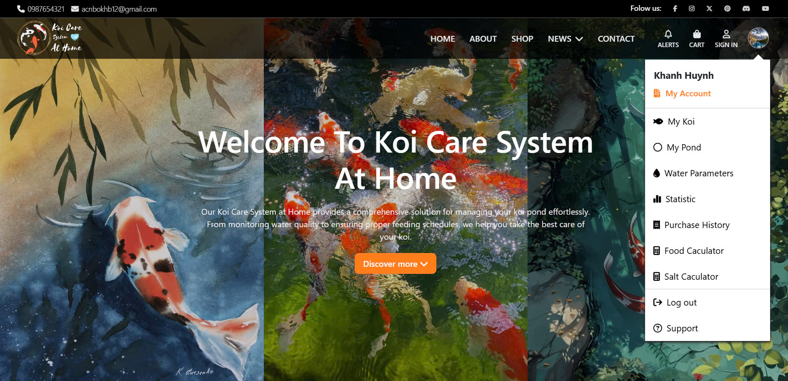

# **Koi Care System at Home**

## **Introduction**  
The **Koi Care System at Home** is a frontend user interface designed to assist koi fish enthusiasts in managing and caring for their koi ponds. The project provides a visually appealing and user-friendly interface to simulate features like tracking pond details, koi growth, and accessing helpful resources.

> **Note**: This project is frontend-only and does not include backend functionality such as data storage, processing, or API integration.

---

## **Technologies Used**  
- **HTML5**: Structure and layout of the interface.  
- **CSS3**: Styling and visual design.  
- **JavaScript**: For interactivity and dynamic behavior.  
- **Bootstrap** (optional): For responsive and modern UI design.  
- **ECharts** (optional): For rendering charts and data visualizations.  

---

## **Preview**  

### **Home Page**  
 

---

## **Main UI Components**  
1. **Home Page**  
   - A welcoming interface that introduces the system and its purpose.  

2. **Pond Management**  
   - Displays information about koi ponds, such as size and environmental parameters (KH, GH, pH).

3. **Growth Tracking**  
   - Visualizes koi growth data through interactive charts (with sample data if provided).  

4. **Online Store**  
   - Simulates a product listing for items like fish food, medicine, and accessories.

5. **Blog/News Page**  
   - Features articles or tips about koi fish care.

---


## **How to Run the Project**  
1. **Clone the Repository**:  
   ```bash
   git clone https://github.com/acnbokhb12/KoiCare.git
